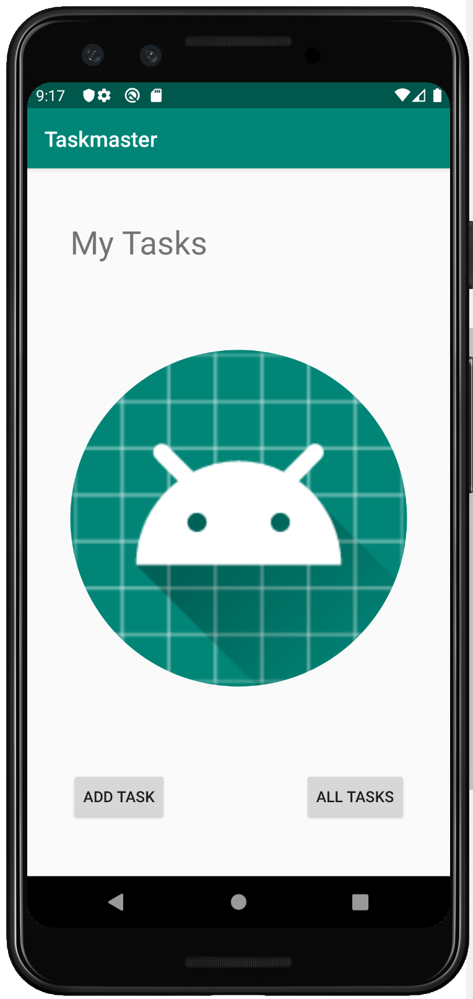
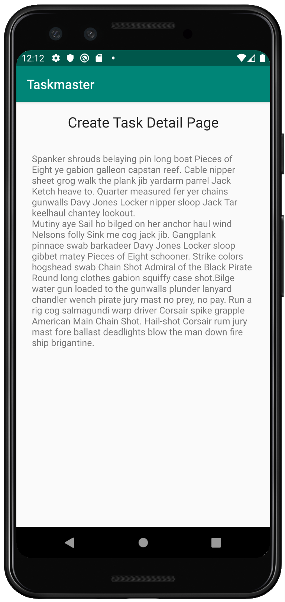
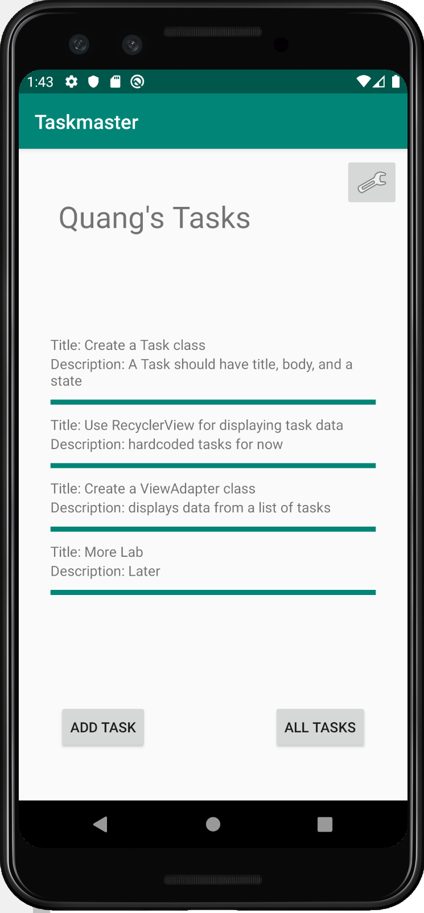

# TaskMaster

This android app will track all the tasks that a user need to do and allow user to add new tasks

# Daily Change Log

### Tuesday 10/22/2019 

#### What I Worked On

* Created Home Page to include a placeholder image and two buttons to take user to add task page and all tasks page
* For add task page, I created two input fields for user to add task title and description and also a button for submission. For now, the submit button only show a pop up message with the word "Submitted!"
* For all tasks page, there is an image and a label.  

#### Images

### Wednesday 10/23/2019

#### What I Worked On

* Create a setting page that allow users to enter their username and save it so that it would show on the home page.
* Create a task detail page so when user select a certain task on the home page, the title of the task will show as the title of the task detail page.
* Update home page to show the username and added buttons to navigate to setting and task detail page

#### Images

### Thursday 10/24/2019 

#### What I Worked On

* Create a Task class. A Task should have a title, a body, and a state. The state should be one of “new”, “assigned”, “in progress”, or “complete”.
* Refactor my homepage to use a RecyclerView for displaying Task data. This has hardcoded Task data for now
* Ensure that you can tap on any one of the Tasks in the RecyclerView, and it will appropriately launch the detail page with the correct Task title displayed.

#### Images

### Friday 10/25/2019 

#### What I Worked On

* Modify Task class to be an Entity
* Set up Room in my application
* Modify my Add Task form to save the data entered in as a Task in my local database
* Refactor my homepage's RecyclerView to display all Task entities in my database

### Tuesday 10/29/2019

#### What I Worked On

* Make a request to the backend server when user gets to the home page to fetch Task data. Afterward, display that Task data in my RecyclerView.
* Modify my Add Task form to post the entered task to the server 
* Ensure that the homepage refreshes the Tasks shown after a Task has been added.

### Wednesday 10/30/2019

#### What I Worked On

* Update all references to the Task data to instead use AWS Amplify to access the data in DynamoDB instead of in Room. 
* Modify my Add Task form to save the data entered in as a Task to DynamoDB
* Refactor my homepage's RecyclerView to display all Task entities in DynamoDB

### Thursday 10/31/2019

#### What I Worked On

* Create a second entity for a team, which has a name and a list of tasks. Update my tasks to be owned by a team.
* Modify my Add Task form to include Radio Buttons for which team that task belongs to.
* In addition to a username, added Radio Buttons to allow the user to choose their team on the Settings page. Use that Team to display only that team’s tasks on the homepage.

### Friday 11/1/2019

#### WHat I Worked On

* Create a page for users to add new teams.
* Replace radio buttons with spinners for displaying and selecting available teams.
* Refactor code to have state field be enum instead of String.

### Tuesday 11/5/2019

#### What I Worked On

* Add Cognito to my Amplify setup.
* Add in user login and sign up flows to my application, using Cognito’s pre-built UI as appropriate.
* Display the logged in user’s username on the main page
* Allow users to log out of your application.

